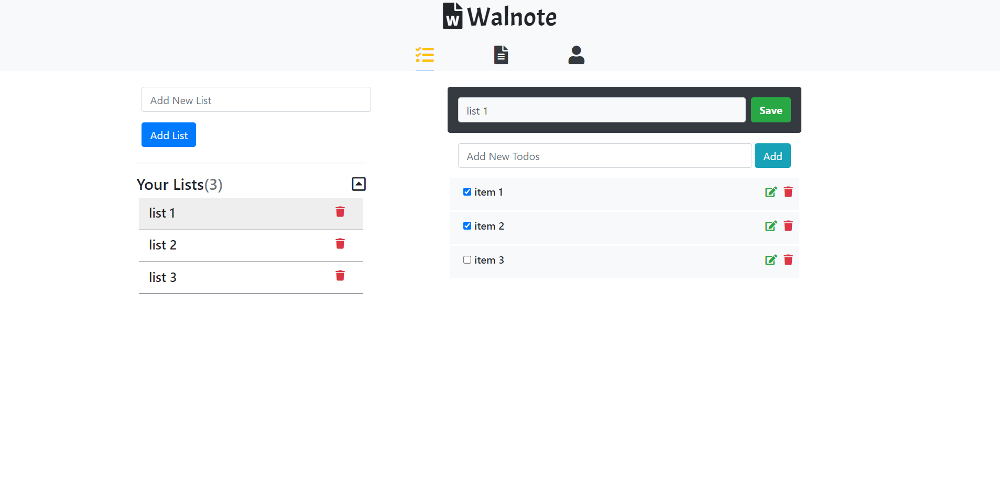
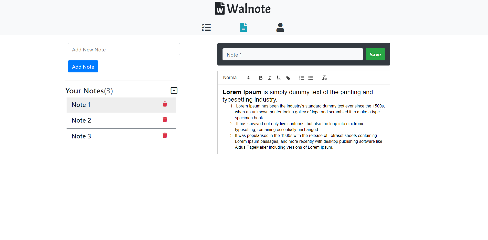

# Walnote

> Note Taking and Todo List App. (Notion clone)

#### Technology used

> Stack: MERN  
> Auth: Passport OAuth 2.0

#### Features

> **Create Tasks:** Add different categories of lists and setup tasks/todos for each.  
> **Take Notes:** Keep notes organized and add any type of content.  
> **User Security:** This application ensures User Authentication, Authorization & Data Encryption.

<h6>
#1 Tasks / Todo List | #2 Note Taking
</h6>

[Mobile App Repo](https://github.com/A7abhilash/walnote-app)
